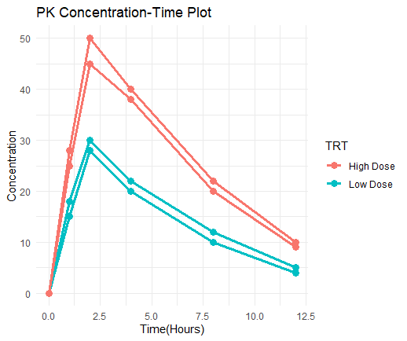

# Clinical PK Plotting in R

Reusable R functions for pharmacokinetic concentration-time visualization using ggplot2.

## Features

- Individual concentration-time profiles
- Semi-log PK plots
- BLQ visualization
- LLOQ reference lines
- Mean concentration-time plots with error bars
- Dose-normalized concentration profiles
- Flexible reusable plotting function

## Technologies Used

- R
- ggplot2
- tidyverse
- dplyr

## Main Function

```r
plot_pk_flexible()
```

Supports:
- dynamic y-variable selection
- optional log scaling
- optional faceting
- BLQ shape mapping
- LLOQ annotations
- error bars
- dose-normalized concentration plots

## Example PK Visualizations

### Individual PK Profile



### Semi-log PK Profile

(Upload screenshot later)

### Mean Concentration-Time Plot

(Upload screenshot later)

## Clinical Relevance

These visualizations are commonly used by clinicians and pharmacometricians to evaluate:
- drug exposure
- dose proportionality
- inter-subject variability
- terminal elimination
- BLQ behavior
- assay sensitivity thresholds
